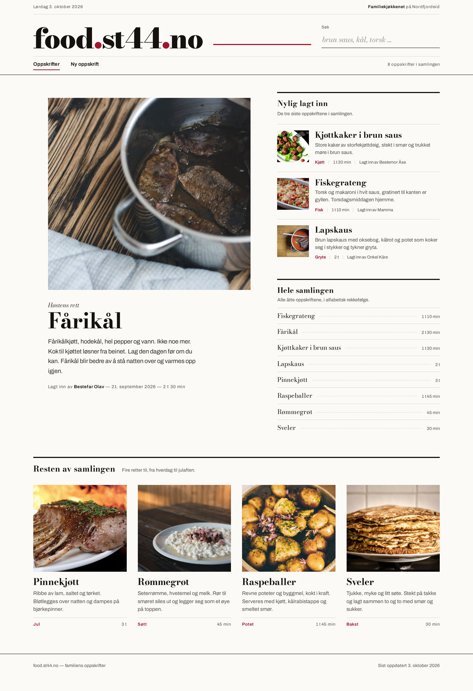
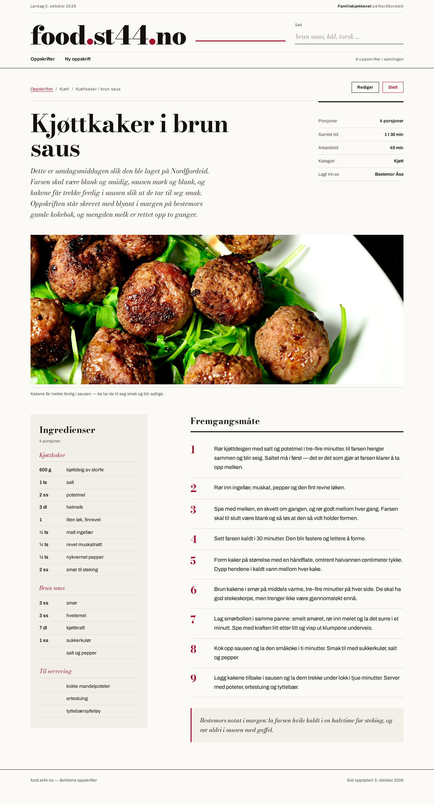

# food.st44.no — design guide

The design rules for this site, in the site's own repo. They used to live in the designers'
agent instructions; they were moved here on ST-745 so that anyone who designs or builds a
screen on food.st44.no reads the same thing. Agent instructions now say only: *read the
project's design guide and its signed-off pictures first*.

**Precedence, highest first:**

1. **The signed-off picture** (§1). It is the spec.
2. **This guide.** It describes that picture; it is never stricter than the picture. If a rule
   here would remove or tone down something the picture visibly does, the rule is wrong — fix
   the rule, not the picture.
3. **`AGENTS.md`** for what CI enforces (palette, Angular, API contract), and `ST-233`'s style
   guide for the MVP component and accessibility checklists that survived (§6, §7 there).

Who does what: **Ida** owns design and UX for food.st44.no — flows, wireframes, UI behaviour,
the Norwegian label set. **Astrid** owns art direction — the look: type, colour, grid, image
treatment, masthead. Both work to the picture below.

---

## 1. The signed-off picture

Stig picked **direction 1, "Søndag"**, out of five on **2026-10-03** (decision ST-272;
the five directions are ST-265). It was built as the real front end (ST-286, PRs #32–#34) and
is what food.st44.no runs today; the Angular rewrite in `v2/` ported it without changing the
look. These four files are the spec:

| | Desktop 1280 px | Mobile 390 px |
|---|---|---|
| **Forside** | [`reference/sondag-forside-1280.jpg`](reference/sondag-forside-1280.jpg) | [`reference/sondag-forside-390.jpg`](reference/sondag-forside-390.jpg) |
| **Oppskrift** | [`reference/sondag-oppskrift-1280.jpg`](reference/sondag-oppskrift-1280.jpg) | [`reference/sondag-oppskrift-390.jpg`](reference/sondag-oppskrift-390.jpg) |

### What the picture visibly does

Write a new screen against this list, not against a memory of it.

- **A Saturday supplement, not an app.** Paper-white page, black serif, one crimson. Nothing
  floats: no cards with shadows, no rounded corners, no pills, no filled chrome. Structure is
  made of **rules** — hairlines, a 3 px black rule over a section, dotted leaders in a list.
- **A real masthead, three bands.** A small dated line (`Lørdag 3. oktober 2026`) with
  `Familiekjøkkenet` right-aligned; then the wordmark **food.st44.no** in Bodoni Moda, very
  large (≈46 px+), with the two dots in crimson and a **crimson rule running out of the
  wordmark to the right**, and the search set as a plain ruled line (label above, italic
  Bodoni placeholder, no box, no button); then a nav rule carrying `Oppskrifter`
  `Ny oppskrift` as plain text links with a crimson underline on the current page, and the
  collection count right-aligned. No logo badge, no hamburger.
- **The front page opens on one dish.** A large photograph fills the left column, under it an
  italic kicker, then the title in Bodoni at display size, a short paragraph, and a thin meta
  line. The opening is a picture, given room.
- **The collection is a register, not a grid of equal cards.** Right column: *Nylig lagt inn*
  (three entries with a small square photo, title, two lines, meta) over a 3 px rule, then
  *Hele samlingen* — every recipe as one ruled line with **dotted leaders** and the time
  right-aligned. The whole archive readable in one glance.
- **Below the fold, four dishes in a row** with photographs at equal size, title in Bodoni, two
  lines of text, and a crimson keyword plus time on a hairline under each.
- **The recipe page is an article.** Breadcrumb; `Rediger` (outlined black) and `Slett`
  (outlined crimson) top right; the title in Bodoni at display size over two lines; a lead
  paragraph in **Bodoni italic**; a facts table on hairlines to the right; then a full-width
  photograph with a small caption; then two columns — **ingredients in a tinted panel**
  (`--tint`) with the quantity in its own column and crimson italic sub-headings, and
  **Fremgangsmåte** with large crimson numerals and each step on a hairline. It closes on a
  tinted note block with a crimson left rule, set in Bodoni italic.
- **Mobile is the same material in reading order**, not a different design. The masthead
  compresses to the same three bands; lead dish, the three latest, the register, then the rest;
  the nav becomes a sticky opaque bar under 760 px so **Ny oppskrift** stays one tap away.
- **Mood:** quiet, dense, printed. Lots of white paper and small type doing careful work; the
  loud things are the photographs and the wordmark.

Reference photographs of the **built** site (every page, 1280/390/360 px, including search,
empty collection, forms, errors) are in the `sondag-levert` document on ST-286.

### Crimson is rationed

In the picture crimson appears in: the wordmark dots, the masthead rule, the current-page
underline, the keyword under a dish, the step numerals, the ingredient sub-headings, the focus
ring, and the `Slett` outline. It is a **fill** only on the delete confirmation button. Keep it
that way: crimson marks where you are and what is dangerous, never a decoration.

---

## 2. What the picture shows that the data cannot carry

The directions were drawn against invented content. The database has five fields —
`title`, `ingredients`, `instructions`, `created_at`, `photo` (`v2/backend/food/models.py`).
These substitutions were accepted when Søndag was built and still stand:

| In the picture | On the site | Why |
|---|---|---|
| `Kjøtt · 1 t 30 min · Lagt inn av Bestemor Åse` | `15 ingredienser · 18. sep` | No category, time or cook exists. Both of these are true and still scannable. |
| A written description under the lead dish | One Bodoni italic line: `6 ingredienser, lagt inn 21. september 2026.` | No description field; the line keeps the editorial weight without inventing prose. |
| Five-row facts table on the recipe page | Three rows: ingredients, steps, date added | Only three of the five are knowable. |
| Ingredients grouped under `Kjøttkaker` / `Brun saus` | One flat list, the amount split into its own column | Groups would be a new feature. The amount column is parsed from the line. |
| `Høstens rett` kicker | `Sist lagt inn` | Seasonal editing is a person's job; this one is true and explains why that dish is there. |
| `Familiekjøkkenet på Nordfjordeid` | `Familiekjøkkenet` | The place could not be verified. |

**Do not restore the picture by inventing data.** A new field (category, time, cook, servings)
is a product decision for Maria and Stig, not something a design PR adds.

---

## 3. Rules that follow from the picture

### 3.1 The masthead is designed on every page

It is the first thing the owner judges. Every page carries the full masthead — including
*Fant ikke oppskriften*, *Siden finnes ikke* and *Noe gikk galt*, so a reader is never thrown
out of the site. The only accepted change is the empty collection, where the search field and
the count are removed because there is nothing to search. A failed query is **not** empty: the
search stays, the count goes. The markup lives in `v2/frontend/src/app/app.html`; when you draw
a new page, draw its masthead too rather than cropping it out of the mockup.

### 3.2 Food is visual — plan for photography

- The opening of the front page and the top of a recipe are **photographs**, large and quiet.
- In mockups use **real, license-free food photos** fetched from Unsplash or Pexels source
  URLs, or placeholders art-directed so they look intentional. **Never grey boxes**, never a
  blank rectangle labelled "image".
- Real recipes carry one uploaded photo (`Recipe.photo`). Most of the family's recipes will not
  have one, so **the no-photo case is a designed case, not a hole**: the `.plate` — tinted
  paper, a 3 px crimson top rule and fine ruled lines (`v2/frontend/src/styles.css`) — or a
  recipe that opens on its title instead. Both are decisions; a grey box is not.
- Say in the hand-in when photographs are stand-ins. The CC0 dishes in the picture above are
  approximate; the real ones should eventually be shot at home.

### 3.3 Real Norwegian content

Norwegian bokmål everywhere, in mockups as well as in the app: `Oppskrifter`, `Ny oppskrift`,
`Rediger`, `Slett`, `Søk`, `Fremgangsmåte`, `Ingredienser`, `Porsjoner`. The full label set is
§6 of the style guide on ST-233.

Use real dishes — Fårikål, Kjøttkaker i brun saus, Fiskegrateng, Lapskaus, Pinnekjøtt,
Rømmegrøt, Raspeballer, Sveler, Tilslørte bondepiker — with plausible ingredients and method.
**No lorem ipsum, no English placeholder names.** Use the same set of dishes across the screens
of one hand-in, so a comparison is about design and not about content.

### 3.4 How a design is delivered

- Build the design as **static HTML and CSS**, or as the real app, and **photograph it with
  headless Chromium or Playwright**. Full page, **1280 px desktop and 390 px mobile** — add
  **360 px** when a sticky bar, a long title or a form is involved.
- **Never deliver ASCII art, a text description or a drawing of a layout instead of an image.**
- Look at every screenshot before handing in, and fix anything cramped, misaligned, unfinished
  or generic.
- **Compare side by side with §1 before you hand in.** Put the signed-off picture and the new
  work in one image at the same scale, attach it, and list every visible difference with its
  reason at the top of the hand-in. A difference with no reason is a fault; fix it.
- **A change to the look is Maria's call.** Taking a colour away, flattening a button,
  swapping a mode: list it under "Changes from the signed-off picture" and send it to Maria
  *before* the final drawings.

### 3.5 Touching the repo and the live site

Do not change the food repo or the live site unless a task says to. A merge to `main` that
touches `v2/**`, `Dockerfile` or `infra/**` **deploys to food.st44.no** — only Markdown,
`docs/**` and the retired v1 paths skip it. Never merge without Maria's go (`AGENTS.md`,
"Deploy"). Design work lands as a branch and a PR; someone else merges.

---

## 4. The system as it lives in code

Everything is plain CSS. No Tailwind, no Sass, no component library.

`v2/frontend/src/styles.css` holds the tokens, the base type and everything shared; each
component keeps its own CSS file next to it (`recipe-detail.css`, `recipe-list.css`,
`recipe-form.css`, …).

**Six colours, no others** — stylelint (`sondag/palette`) rejects hex, `rgb()`, `hsl()`,
`oklch()`, `color-mix()` and named colours in component CSS:

| Token | Value | What it is |
|---|---|---|
| `--paper` | `#FBFAF7` | the page |
| `--ink` | `#14110E` | text, rules at full strength, primary button fill |
| `--soft` | `#5B544C` | meta lines, hints |
| `--rule` | `#DED8CE` | hairlines, leaders, field borders |
| `--red` | `#A4142E` | crimson — see §1, "Crimson is rationed" |
| `--tint` | `#F2EFE8` | ingredient panel, note block, plate, flash |

**A seventh colour is a design decision for Maria, never something added to get CI green.**

Type: `--disp` Bodoni Moda (display: wordmark, titles, section headings, numerals, italic
leads and notes) and `--ui` Archivo (everything else). Self-hosted from `/fonts`. Display sizes
run ≈46 px desktop / 34 px at ≤760 px; interface text 16 px body, 14.5 px small, 13 px labels,
12.5 px buttons and hints, with letter-spacing only on the small uppercase-ish labels.

Shape: square. `border-radius: 0` on buttons; borders are 1 px hairlines or 3 px accents.
`--tap: 44px` is the minimum touch target. The single breakpoint is `width <= 760px`
(`.wrap` padding 40 → 20 px, the 12-column `.grid` collapses to one column).

---

## 5. Accessibility inside the look

Elegance must not cost readability — and readability is never bought by removing the look.
When contrast fails, change the text colour and keep the design.

Measured on the built site: ink on paper **18.0:1**, ink on tint **16.4:1**, soft **7.1:1**,
crimson **7.4:1**. All past AA. (The mockup's search placeholder `#9A9288` at 2.9:1 was the one
failure; it became `#756D62` at 4.9:1 and still reads as a placeholder.)

Before a design is delivered or a UI PR is opened:

- Text contrast ≥ 4.5:1, control boundaries ≥ 3:1. Measure; do not estimate.
- Focus is visible on every link, button and field: `2 px solid var(--red)`, `3 px` offset,
  set once in `styles.css` and never removed. Screenshot it at least once per hand-in.
- Keyboard path in reading order: skip link → search → nav → content.
- One `<h1>` per page, headings never skip, landmarks present, every input labelled.
- Errors: a focused summary whose lines link to the field, plus the message under the field.
  Never colour alone.
- `prefers-reduced-motion` respected. The site does not animate on its own.
- 200 % zoom without horizontal scrolling; no horizontal overflow at 1280, 390 or 360 px.
- Touch targets ≥ 44 × 44 px.

The full MVP checklist is §7 of the style guide on ST-233.

---

## 6. Before you hand in

1. Side-by-side with §1 at the same scale, attached. Would Stig recognise it as the picture he
   chose?
2. Every visible difference listed with its reason, at the top of the hand-in.
3. Changes to the look sent to Maria separately, before the final drawings.
4. Screenshots at 1280 and 390 px (and 360 px where it matters), real renders, full page.
5. Norwegian content, real dishes, no lorem ipsum.
6. Six colours. Focus ring shown. Contrast measured.
7. Nothing merged or deployed without Maria's go.

---

## 7. Rules moved here, and what was dropped

From Astrid's agent instructions (ST-743), all food-specific:

| Rule | Where it went |
|---|---|
| "You work on food.st44.no (a Norwegian family recipe site)" | Dropped as a rule — it is the scope of this file. The Diddit half of that sentence stays with Diddit. |
| "Design the header/masthead deliberately on every page. It is the first thing the owner judges." | §3.1, with what the masthead actually is in the picture. |
| "Food is visual: plan for photography … never grey boxes" | §3.2 |
| "Build static HTML/CSS mockups and render real PNG screenshots … 1280 px and 390 px. Never ASCII art" | §3.4 |
| "Use real Norwegian content (Fiskegrateng, Kjøttkaker i brun saus, …). No lorem ipsum." | §3.3 |
| "Do not change the food repo or the live site unless a task tells you to." | §3.5 |

From Ida's agent instructions (ST-743):

| Rule | Where it went |
|---|---|
| "You own design and UX for the products you are assigned, first food.st44.no." | The "Who does what" line at the top of this file, stated as a split with art direction rather than as a per-agent instruction. |

Nothing was dropped for being wrong. What was *added* here is the part the instructions could
not carry: the signed-off picture itself (§1), the accepted differences between it and the data
(§2), and the system as it is actually built (§4, §5).
